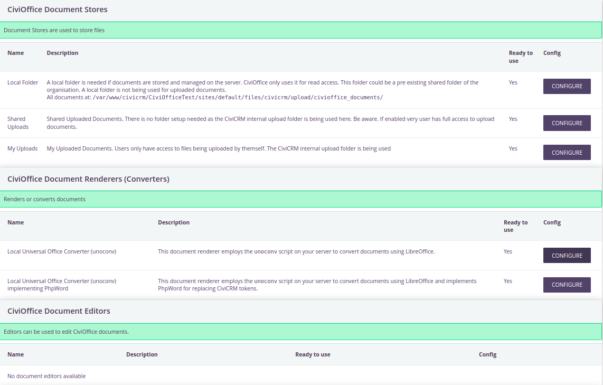

# Configuration

Configuration options can be found at Administration -> Administration Console
-> Communication -> CiviOffice Settings or `/civicrm/admin/civioffice/settings`.

Via the *Configure* button, the respective options can be activated either by
placing a tick, or by specifying a path. The column *Ready To Use* gives
feedback on the successful activation.

## Document Stores

These locations for document storage are currently available:

1. **Local Folder**: A local folder is required if documents are stored on the
   server and managed independently by the server. This could be an existing
   document system or a Samba share. CiviOffice uses it for read-only access. A
   local folder is not used for uploaded documents and should not be confused
   with the Temp folder of the renderer.
2. **Shared Uploads**: Documents can be uploaded here for shared use in the
   organisation. If activated, it enables *all users* to upload documents.
3. **My Uploads**: Documents for the personal use of the CiviCRM user are stored
   here. At the least, this store should be activated for using CiviOffice.

## Document Renderers

Two paths are entered here that are essential for using CiviOffice:

1. **The path to the binary of unoconv**: Usually this is `/usr/bin/unoconv`.
   The path can otherwise be determined with the following console
   command: ``which unoconv``.
2. **The path to the temp folder**: A subfolder of
   CiviCRM's `templates_c` directory. As an example, on a Drupal-based site,
   this might look like `/var/www/vhosts/[YOUR_DOMAIN]/httpdocs/dev/public/sites/default/files/civicrm/templates_c/civioffice`

The directory, here named ``civioffice``, must be created manually in the
described path. Although the path (and name) might be set differently, we
recommend creating the directory inside `templates_c`.

The path entry is verified dynamically, so saving is only possible when an
existing path is entered. In case of permission problems, you will receive a
warning with detailed information.

## Document Editors

(Editor modules are a planned feature, nothing to do here yet.)

Example of a working configuration menu:

