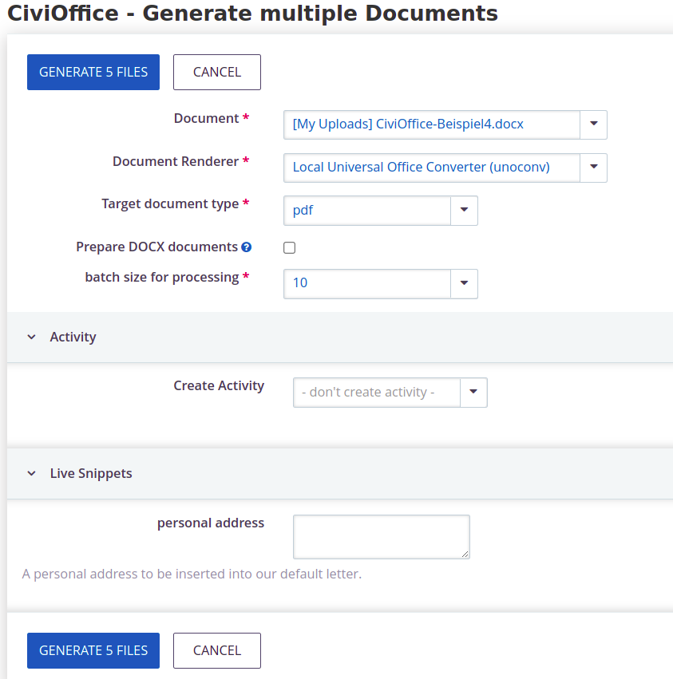

# Working With Documents
## Managing documents
With the integrated document stores for personal and shared uploads, the documents to be used as templates in CiviOffice can be managed via
``/civicrm/civioffice/document_upload``. (A user with admin privileges can add a navigation menu item linked to that page.) 

In future versions, other document stores can be added. 

### Available Documents
With the blue icon next to the the heading, you can switch between the stores (*Shared Documents* / *Private Documents*), if both are configured.
The table shows the available documents of the selected store. These can be deleted or downloaded under *Actions*.

### Upload More
If at least one document store is configured, a .docx file can be selected, uploaded and made available to others using the common button.

## Creating a document for multiple contacts

From a contact search result, select the intended contact records. Then, select the action **Create Documents** which will take you to a form with different options for the rendering of your document.

Choose the document you want to use as a template. If you have more than one renderer configured, you can also choose between those here.

Clicking the ``Generate File(s)`` button will trigger the rendering and subsequently the download process. Depending on the number of documents, this can take some time. Your files will be downloaded in a .zip archive.

Afterwards please always use the "back to previous page" button to finish this process by delete the created document from the main memory and thus free up the memory space. This is particularly important for larger processing runs.

Example of "Generate Documents" page:

## Creating a document for a single contact

In the overview for a single contact, the extension creates a new option in the ``Actions`` menu, ``Create CiviOffice document``. The workflow is similar to that for multiple contacts, but additionally you can choose to create an activity, the activity type and whether the generated .pdf document should be attached. 